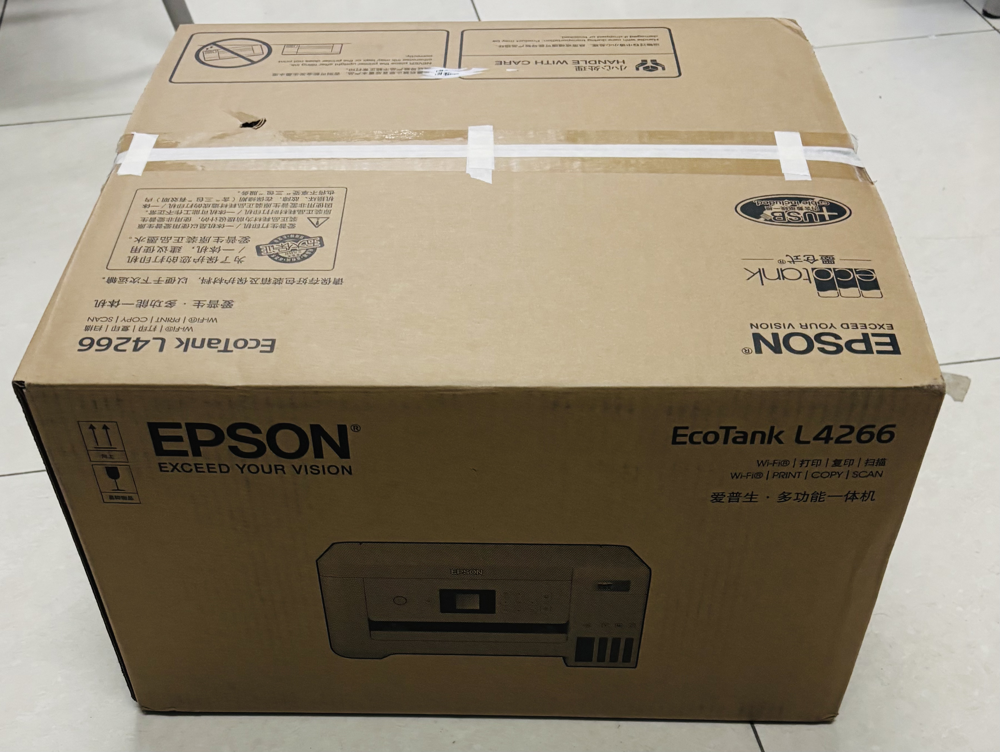

# Printer

This repository documents the printers I own, what I know about them, and how I use and maintain them.
 It also serves as a simple reference on common printer brands, basic printer concepts, and usage tips.

------

## 1. Introduction to Printers

A **printer** is a peripheral device that produces physical output (usually on paper) from digital data.
 Most consumer printers today fall into two major categories:

-   **Inkjet printers** — versatile, capable of printing photos and documents, generally lower upfront cost.
-   **Laser printers** — faster and more efficient for high-volume text printing, typically lower cost per page.

Modern home printers often support Wi-Fi, automatic duplex printing, mobile printing, and integrated ink tanks to reduce long-term consumable costs.

------

## 2. Printers I Own

| Purchase Date | Brand | Model    | Price Paid (CNY) |
| ------------- | ----- | -------- | ---------------- |
| 2024-11-23    | EPSON | L4266    | 1310.07          |
| 2023-07-12    | HP    | Tank 672 | 1499             |

------

## 3. Device Overview

### EPSON L4266

The Epson L4266 is an **ink-tank color inkjet printer** known for its low cost per page and efficient ink usage.
 Key features include:

-   EcoTank design with refillable ink bottles
-   Duplex (double-sided) printing
-   Wi-Fi and mobile printing support
-   Good photo and document quality

It is suitable for home or small-office environments that require economical color printing.

------

### HP Tank 672

The HP Tank 672 is HP’s **Smart Tank** series device, similarly focused on low-cost, high-yield printing.
 Notable features:

-   Integrated refillable ink tank system
-   Reliable text quality and decent color output
-   Simple setup with HP Smart
-   Stable Wi-Fi performance

It is a practical option for users who print frequently and want predictable running costs.

------

## 4. Common Printer Brands

Below are some of the major brands in the consumer and office printer market:

-   **EPSON** – Strong in inkjet, EcoTank series, photo printing
-   **HP** – Popular home and office printers, Smart Tank and LaserJet series
-   **Canon** – Known for photo printers and balanced inkjet models
-   **Brother** – Often preferred for laser printers and office reliability
-   **Pantum** – Emerging budget-friendly laser printer brand
-   **Ricoh / Kyocera** – Common in enterprise environments

------

## 5. Usage Tips for My Printers

### General Usage

-   Connect via Wi-Fi or USB depending on environment.
-   For mobile printing, use **Epson iPrint** or **HP Smart**.
-   Enable duplex printing when possible to save paper.

### Ink Refilling

-   Always use **original or high-quality compatible ink**.
-   Refill slowly to avoid air bubbles in the ink tank.
-   Keep ink bottles tightly sealed when not in use.

### Print Quality Optimization

-   Run **nozzle cleaning** if colors appear broken or faded.
-   Use the **alignment tool** to fix skewed text or lines.
-   For photos, choose **high-quality photo paper** and adjust print settings accordingly.

### Maintenance Tips

-   Print something (even a single page) every **1–2 weeks** to prevent ink drying.
-   Keep the printer in a cool, dry environment away from dust.
-   Avoid turning the printer on/off too frequently; this can waste ink on cleaning cycles.
